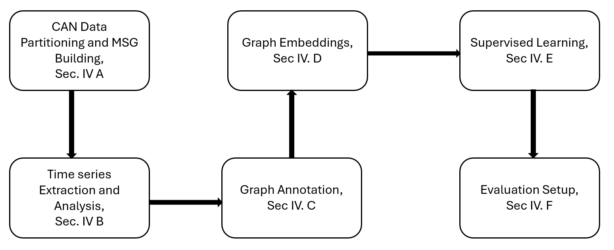

# Detecting Masquerade Attacks in Controller Area Networks Using Graph Machine Learning

## Project Overview




### Main Objective
Design and develop a unified framework to detect both masquerade attacks in the CAN bus that can be deployed on edge devices. We aim to model CAN message streams as CAN graph messages, embedding both node and edge attributes. From this, we can train a model using normal data to detect attacks in the test dataset.

### Key Questions & Hypothesis
- **Question:** Can we detect masquerade attacks in the CAN bus using a graph ML?
- **Hypothesis:** 
  1. CAN messages graphs (embedding both node/edge attributes) may characterize normal/attack conditions in CAN.
  2. Fabrication/masquerade attacks scenarios can be framed as graph classification framework.

### Workflow
1. **Phase 1 - Literature Review**
   - Familiarization with CAN protocol, in-vehicle security, CAN IDS, and Graph ML.
   - Experimentation with the ROAD dataset.

2. **Phase 2 - Building & Annotating CAN Message Graphs**
   - Parse CAN data to build CAN message graphs.
   - Partition CAN streaming data into temporal CAN message graphs.
   - Embed attributes from CAN signals into nodes and frequency of messages into edges.

3. **Phase 3 - Experiments with GNN for Graph Classification**
   - Build training datasets based on CAN graph messages.
   - Train the Graph ML framework for IDS in CAN graph messages.
   - Test the trained GNN framework on attack captures and compute classification metrics.


### Dataset:
- **ROAD Dataset**: This dataset contains multiple hours of recorded data, with 3 hours for training and 30 minutes for testing, covering various driving scenarios. It includes five masquerade attacks: correlated signal, max engine, max speedometer, reverse light off, and reverse light on attacks. For more details, refer to the [ROAD dataset paper](https://doi.org/10.1371/journal.pone.0296879). Here is a detailed tree structure for the dataset used in this project: 

```
road/
├── ambient
├── attacks
├── data_table.csv
├── readme.md
└── signal_extractions
├── ambient
│ ├── ambient_dyno_drive_basic_long.csv
│ ├── ambient_dyno_drive_basic_short.csv
│ ├── ambient_dyno_drive_benign_anomaly.csv
│ ├── ambient_dyno_drive_extended_long.csv
│ ├── ambient_dyno_drive_extended_short.csv
│ ├── ambient_dyno_drive_radio_infotainment.csv
│ ├── ambient_dyno_drive_winter.csv
│ ├── ambient_dyno_exercise_all_bits.csv
│ ├── ambient_dyno_idle_radio_infotainment.csv
│ ├── ambient_dyno_reverse.csv
│ ├── ambient_highway_street_driving_diagnostics.csv
│ ├── ambient_highway_street_driving_long.csv
├── attacks
│ ├── accelerator_attack_drive_1.csv
│ ├── accelerator_attack_drive_2.csv
│ ├── accelerator_attack_reverse_1.csv
│ ├── accelerator_attack_reverse_2.csv
│ ├── correlated_signal_attack_1_masquerade.csv
│ ├── correlated_signal_attack_2_masquerade.csv
│ ├── correlated_signal_attack_3_masquerade.csv
│ ├── max_engine_coolant_temp_attack_masquerade.csv
│ ├── max_speedometer_attack_1_masquerade.csv
│ ├── max_speedometer_attack_2_masquerade.csv
│ ├── max_speedometer_attack_3_masquerade.csv
│ ├── metadata.json
│ ├── reverse_light_off_attack_1_masquerade.csv
│ ├── reverse_light_off_attack_2_masquerade.csv
│ ├── reverse_light_off_attack_3_masquerade.csv
│ ├── reverse_light_on_attack_1_masquerade.csv
│ ├── reverse_light_on_attack_2_masquerade.csv
│ ├── reverse_light_on_attack_3_masquerade.csv
└── DBC
```


  
## Code Structure

### Python Scripts:

- **ambient_dyno_drive_basic_long.py**:
  - Script to process a specific benign CAN log file `ambient_dyno_drive_basic_long.log`.

- **data_processing.py**:
  - Functions for reading and preprocessing the CAN logs.
  - Functions to partition the CAN data into temporal graphs.

- **embedding_generation.py**:
  - Functions to generate node embeddings using Node2Vec.
  - Functions to generate edge embeddings.

- **imports.py**:
  - Script to import necessary modules and set up the environment for other scripts.

- **main_script.py**:
  - Main script to run the core experiments and analysis on CAN log data.

- **main_script_after_integration_timeseries_signals.py**:
  - Script to process and analyze CAN log data after integrating time-series signals.

- **new_experiment_samples.py**:
  - Functions for analyzing CAN log data using various combinations of window sizes and offsets based on the number of samples.
  - The goal is to understand how different sample-based window sizes and offsets affect the detection and analysis of CAN network activities, both for benign and attack scenarios.
  - This experiment aims to optimize the parameters for better anomaly detection and network activity characterization.

- **process_all_correlated_masquerade_attack_files.py**:
  - Script to process all correlated masquerade attack files.

- **process_all_files.py**:
  - Script to process all benign files.

- **process_all_max_speedometer_attack_files.py**:
  - Script to process all max speedometer masquerade attack files.

- **process_all_reverse_light_off_attack_files.py**:
  - Script to process all reverse light off masquerade attack files.

- **process_all_reverse_light_on_attack_files.py**:
  - Script to process all reverse light on masquerade attack files.

- **process_max_engine_coolant_temp_attack_masquerade_file.py**:
  - Script to process max engine coolant temperature masquerade attack files.

- **requirements.txt**:
  - File containing a list of all the required packages along with their specific versions.

- **run_experiments.py**:
  - Script to run various experiments such as process_all_files_script and process_all_attacks_script at a go on the CAN log data.
 
## Installation of Dependencies

To ensure that you have all the necessary Python packages and dependencies for this project, you can use the `requirements.txt` file provided in the repository. This file contains a list of all the required packages along with their specific versions.

### Installing Dependencies

1. **Using Conda**:
   If you are using Conda, you can create a new environment and install the dependencies from the `requirements.txt` file by running the following commands:

   ```shell
   conda create --name your_env_name python=3.8
   conda activate your_env_name
   pip install -r requirements.txt

## Getting Started

### Running the Code (the window sizes and offsets can be altered depending on overlaps and time slices)

#### Benign Files:
1. **To run only the first benign file, which is `ambient_dyno_drive_basic_long.log`:**
   ```shell
   python ambient_dyno_drive_basic_long.py --window-size 10 --offset 10 --pkl-folder road_ambient_dyno_drive_basic_long_050305_002000 "C:\Users\willi\OneDrive\Desktop\Research\oak_ridge_in_vehicle\road\ambient\ambient_dyno_drive_basic_long.log"
   ```

2. **To run all benign files:**
   ```shell
   python process_all_files.py --window-size 4 --offset 4
   ```

#### Attack Files:
3. **To process all `correlated masquerade attack files` in TTW-only mode:**
   ```shell
   python process_all_correlated_masquerade_attack_files.py --mode ttw-only --window-size 2 --offset 1
   ```

   **To process all `correlated masquerade attack files` in full-pipeline mode:**
   ```shell
   python process_all_correlated_masquerade_attack_files.py --mode full-pipeline --window-size 2 --offset 1
   ```

4. **To process all `reverse light off masquerade attack files` in TTW-only mode:**
   ```shell
   python process_all_reverse_light_off_attack_files.py --mode ttw-only --window-size 2 --offset 1
   ```

   **To process all `reverse light off masquerade attack files` in full-pipeline mode:**
   ```shell
   python process_all_reverse_light_off_attack_files.py --mode full-pipeline --window-size 2 --offset 1
   ```

5. **To process all `reverse light on masquerade attack files` in TTW-only mode:**
   ```shell
   python process_all_reverse_light_on_attack_files.py --mode ttw-only --window-size 2 --offset 1
   ```

   **To process all `reverse light on masquerade attack files` in full-pipeline mode:**
   ```shell
   python process_all_reverse_light_on_attack_files.py --mode full-pipeline --window-size 2 --offset 1
   ```

6. **To process all `max engine coolant temperature masquerade attack files` in TTW-only mode:**
   ```shell
   python process_max_engine_coolant_temp_attack_masquerade_file.py --mode ttw-only --window-size 2 --offset 1
   ```

   **To process all `max engine coolant temperature masquerade attack files` in full-pipeline mode:**
   ```shell
   python process_max_engine_coolant_temp_attack_masquerade_file.py --mode full-pipeline --window-size 2 --offset 1
   ```

7. **To process all `max speedometer masquerade attack files` in TTW-only mode:**
   ```shell
   python process_all_max_speedometer_attack_files.py --mode ttw-only --window-size 2 --offset 1
   ```

   **To process all `max speedometer masquerade attack files` in full-pipeline mode:**
   ```shell
   python process_all_max_speedometer_attack_files.py --mode full-pipeline --window-size 2 --offset 1
   ```

8. **To run TTW calculations for all attack types (TTW-only mode):**
   ```shell
   python run_all_ttw_attacks.py

   ```
### Time-to-Window (TTW) Metrics
Time-to-Window (TTW) is a performance metric used to evaluate the computational efficiency of intrusion detection systems (IDS) in real-time environments. It measures the time taken to process a sliding window of CAN messages and make a detection decision. The formula for TTW is:

\[
\text{TTW} = \frac{\text{Total Detection Time}}{\text{Number of Windows}}
\]

- **Total Detection Time**: The total time taken to process all windows in the dataset.
- **Number of Windows**: The total number of sliding windows generated from the dataset.

TTW provides insights into the real-time feasibility of the IDS, especially in resource-constrained environments like vehicles.

---

### New Experiment: Sample-Based Analysis
This new set of experiments focuses on analyzing CAN log data using various combinations of window sizes and offsets based on the number of samples, rather than time. The goal is to understand how different sample-based window sizes and offsets affect the detection and analysis of CAN network activities, both for benign and attack scenarios. This experiment aims to optimize the parameters for better anomaly detection and network activity characterization.

#### Running the New Experiment:
8. **To process new experiment samples for attack scenarios:**
   ```shell
   python new_experiment_samples.py --window-size 50 --offset 50
   ```

9. **To process new experiment samples for benign scenarios:**
   ```shell
   python new_experiment_samples.py --window-size 50 --offset 50 --attack-type benign
   ```
### Acknowledgement

This manuscript has been authored by UT-Battelle, LLC under Contract No. DE-AC05-00OR22725 with the U.S. Department of Energy. The publisher, by accepting the article for publication, acknowledges that the U.S. Government retains a non-exclusive, paid-up, irrevocable, world-wide license to publish or reproduce the published form of the manuscript, or allow others to do so, for U.S. Government purposes. The DOE will provide public access to these results in accordance with the DOE Public Access Plan (http://energy.gov/downloads/doe-public-access-plan). This research was sponsored in part by Oak Ridge National Laboratory’s (ORNL’s) Laboratory Directed Research and Development program through the Sustainable Research Pathways (SRP) program and by the DOE. This research is also partially funded by US Department of Energy Award No. DE-FE0032089. There was no additional external funding received for this study. The funders had no role in study design, data collection and analysis, decision to publish, or preparation of this manuscript.
